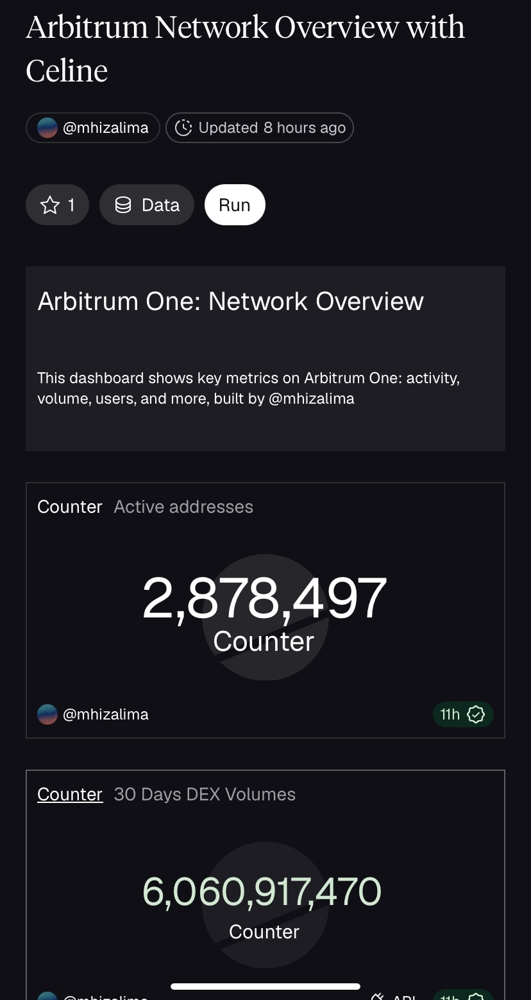
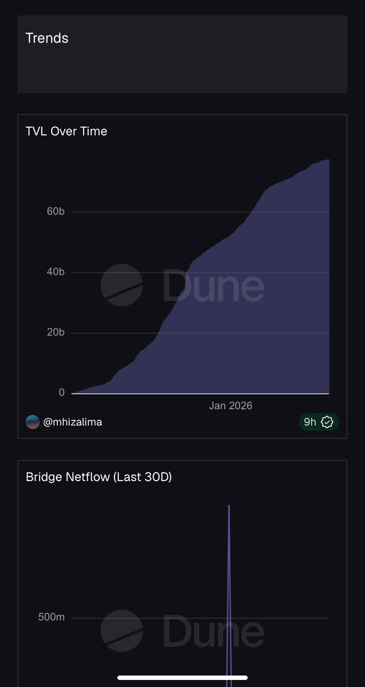
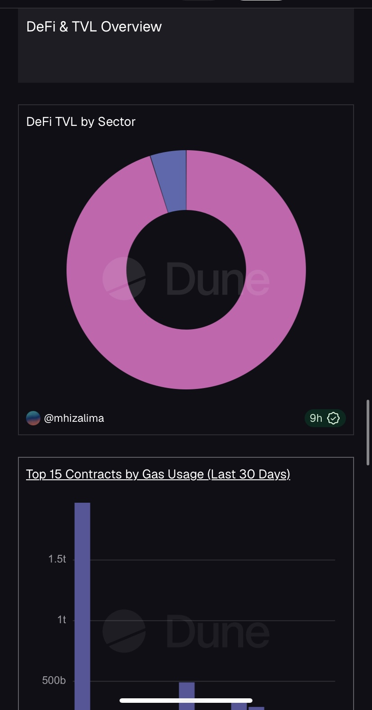

# Arbitrum Network Overview Dashboard

An on-chain analytics dashboard built on Dune to track key ecosystem metrics across the Arbitrum network.

## Overview

This dashboard provides insights into:
- Daily Transactions
- Active Addresses
- Gas Usage
- Network Activity
- Ecosystem Growth Trends

## Dashboard Link

https://dune.com/mhizalima/arbitrum-network-overview-with-celine

## Built With

- SQL
- Dune Analytics
- Blockchain Data

## Goal

To simplify access to Arbitrum on-chain analytics through visual dashboards.

# Dashboard Preview

## Dashboard Overview

---

## Economic Activities

---

## Block Space Activities

---

## Trends Analysis

---

## DeFi & TVL Overview

